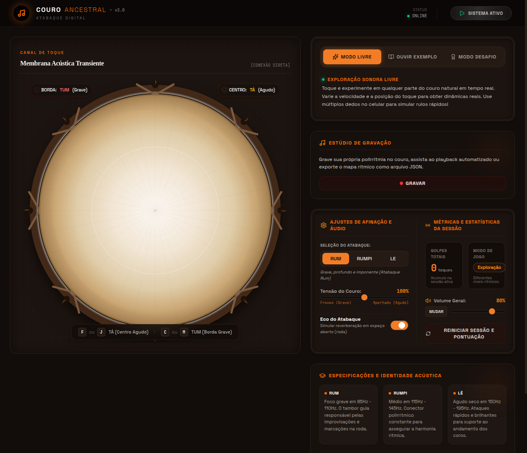

# 🥁 Couro Ancestral v2.0
### A Essência do Atabaque na Palma da sua Mão

O **Couro Ancestral** é um simulador digital de alta fidelidade dedicado à preservação e prática da percussão tradicional brasileira. Mais do que um aplicativo, é uma ponte entre a tecnologia moderna e os ritmos ancestrais que ecoam nos terreiros e rodas de capoeira.

---

## ✨ Experiência Sensorial
O simulador utiliza tecnologia de ponta para reproduzir não apenas o som, mas a **alma** do instrumento:

- **Motor Acústico Realista**: Som baseado em samples reais de alta qualidade (Slap e Open) e síntese física-acústica.
- **Dinâmica de Toque**: A intensidade e o local do toque (borda ou centro) alteram organicamente o timbre.
- **Monitor Espacial**: Suporte a áudio estéreo 3D para uma imersão completa com fones de ouvido.

---

## 🛠️ Funcionalidades Principais

| Recurso | Descrição |
| :--- | :--- |
| **Três Atabaques em Um** | Escolha entre **Rum** (Grave), **Rumpi** (Médio) e **Lê** (Agudo). |
| **Ajuste de Tensão** | Simule o aperto ou afrouxamento do couro em tempo real. |
| **Eco do Atabaque** | Ative a reverberação para simular o som em espaços abertos ou rodas. |
| **Estúdio de Gravação** | Grave suas polirritmias e analise seu desempenho. |
| **Modos de Jogo** | Explore livremente, ouça exemplos tradicionais ou aceite o Modo Desafio. |

---

## 📱 Design Minimalista e Moderno
A nova interface foi projetada para ser elegante e funcional, focando no que realmente importa: a música.

*Novo design minimalista com indicador de status em tempo real.*

---

## 🚀 Como Começar
1. Abra o simulador no seu navegador (Desktop ou Mobile).
2. Clique no botão **"ATIVAR ÁUDIO"** no topo da página.
3. Use o mouse, o toque na tela ou as teclas de atalho:
   - **Centro (TÁ)**: Teclas `F` ou `J`
   - **Borda (TUM)**: Teclas `C` ou `M`

---

> "O couro não apenas soa, ele fala. O Couro Ancestral é o silêncio que se transforma em ritmo."

---
Feito com ❤️ para a preservação da cultura percussiva brasileira.
**WEB AUDIO PROCEDURAL MODELLING ENGINE • 2026**
